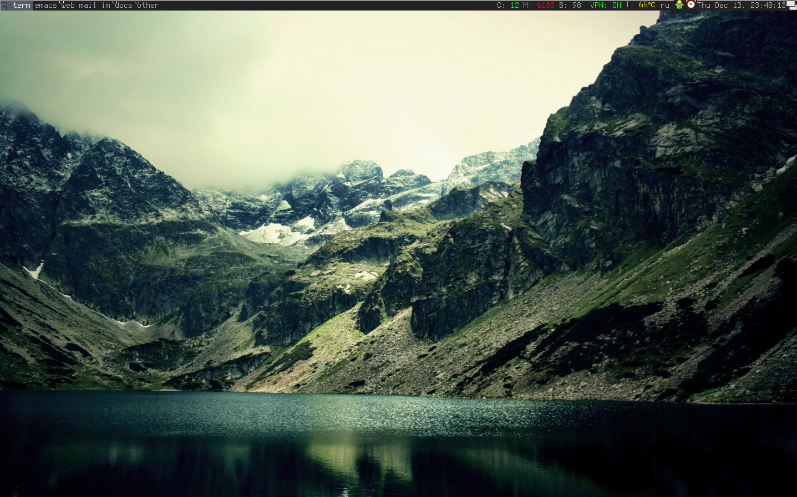

# Ovrd's AwesomeWM configuration

## Features

* CPU
* Memory 
* Battery
* Temperature
* Layout indicator
* VPN ON/OFF based on `ip` parsing
* Wallpaper included, something from wallheaven

## Install

* Go to configuration `cd ~/.config/`
* Clone repo `git clone repo`
* Fetch dependencies `git clone https://github.com/lcpz/lain` 
or 
* with package manager `luarocks install lain`
* Reload AwesomeWM with Ctrl+Super+R
* Ejoy

## Dependencies

https://github.com/lcpz/lain
